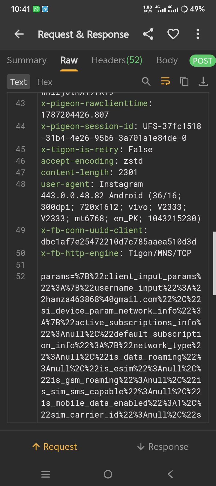

<div align="center">🧬⚡ INSTAGRAM JNI / NATIVE SSL RESEARCH ⚡🧬

👨‍💻 Muhammad Hamza • Android Native Security Lab

<br><br>


</div>---

🧬 NATIVE SYSTEM INFORMATION

╔══════════════════════════════════════════════════════╗
║              INSTAGRAM NATIVE RESEARCH               ║
╠══════════════════════════════════════════════════════╣
║                                                      ║
║  📦 Package       : com.instagram.android            ║
║  🏷️ Version       : 443.0.0.48.82                    ║
║  🖥️ Architecture  : ARM64-v8a                        ║
║  🔗 Interface     : JNI                               ║
║  ⚙️ Module        : Native .so / ELF                 ║
║  🔐 Security      : SSL / TLS Validation Research    ║
║  📡 Environment   : Controlled Research Lab          ║
║                                                      ║
╚══════════════════════════════════════════════════════╝

---

🔗 JNI ARCHITECTURE

              📱 INSTAGRAM ANDROID
                       │
                       ▼
              ┌─────────────────┐
              │   Java / Kotlin │
              └────────┬────────┘
                       │
                       ▼
                  🔗 JNI BRIDGE
                       │
              ┌────────┴────────┐
              │                 │
              ▼                 ▼
        JNI_OnLoad()       Native Methods
              │                 │
              └────────┬────────┘
                       ▼
                 ⚙️ C / C++
                       │
                       ▼
                 🖥️ ARM64 CODE
                       │
                       ▼
                  📦 lib*.so
                       │
                       ▼
                 🔐 TLS LAYER

---

🔬 RESEARCH MODULE

┌─────────────────────────────────────────────────────┐
│                 NATIVE ANALYSIS                     │
├─────────────────────────────────────────────────────┤
│                                                     │
│  🔗 JNI Bridge                                      │
│  🧬 JNI_OnLoad                                      │
│  ⚙️ Native Methods                                  │
│  📦 ELF / .so Libraries                             │
│  🖥️ ARM64 Instructions                              │
│  🔍 Symbol & Function Analysis                      │
│  🔐 SSL/TLS Validation Research                     │
│                                                     │
└─────────────────────────────────────────────────────┘

---

🛠️ RESEARCH STACK

<div align="center">


</div>---

📸 EVIDENCE

<div align="center"><br><br>

🔎 JNI / Native Security Research Evidence

<sub>Captured during controlled Android research.</sub>

</div>---

🌐 CONTACT PANEL

<div align="center">👨‍💻 MUHAMMAD HAMZA

<br>📘 FACEBOOK

<a href="https://www.facebook.com/profile.php?id=100007946797233">

</a><br><br>

📱 WHATSAPP

<a href="https://wa.me/18192720340">

</a></div>---

⚠️ RESEARCH DISCLAIMER

This project is intended for educational and authorized
security research purposes only.

All testing should be performed in controlled environments
and only on applications, devices and accounts for which
you have permission.

The author is not responsible for unauthorized use.

---

<div align="center">🧬 JNI • ARM64 • ELF • SSL/TLS

🔥 POWERED BY MUHAMMAD HAMZA 🔥

<sub>Android Native Security • JNI Research • ARM64 Analysis</sub>

</div>
</div>

---

# 🧠 SYSTEM INFORMATION

```text
📦 Package      : com.instagram.android
🏷️ Version      : 443.0.0.48.82
🖥️ Architecture : ARM64-v8a
⚙️ Module       :
🔐 Security     : SSL Pinning Layer
📡 Mode         : Network Research Lab
```

---

# 🌐 CONTACT PANEL

<div align="center">

### 📘 FACEBOOK
<a href="https://www.facebook.com/profile.php?id=100007946797233">

</a>

<br><br>

### 📱 WHATSAPP
<a href="https://wa.me/18192720340">

</a>

</div>

---

# 📸 EVIDENCE

<div align="center">


</div>

---

# ⚠️ DISCLAIMER

```
This project is for educational and security research purposes only.
All testing must be done in controlled environments.
```

---

<div align="center">

## 🔥 POWERED BY MUHAMMAD HAMZA 🔥

</div>
